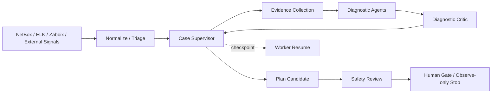

<div align="center">

# AgenticOps

NetBox / ELK / Zabbix AgenticOps 运维系统  
统一事件、Case 编排、多智能体分析、执行闭环、运维记忆

[English README](./README_EN.md)

<p>
  
  
  
  
  
  
</p>

</div>

<p align="center">
  
</p>

## 目录

- [项目简介](#项目简介)
- [核心能力](#核心能力)
- [界面预览](#界面预览)
- [典型链路](#典型链路)
- [当前状态](#当前状态)
- [快速开始](#快速开始)
- [配置说明](#配置说明)
- [核心模块](#核心模块)
- [项目结构](#项目结构)

## 项目简介

AgenticOps 是面向网络运维场景的事件治理与执行闭环系统。系统通过统一事件模型接入 `NetBox`、`ELK`、`Zabbix` 等数据源，并将事件处理链路收敛到：

`Event -> Case -> Multi-Agent -> Memory -> Fabric / Execution`

## 当前状态

仓库已经具备生产候选版本的代码基础：单 PostgreSQL 数据库、OIDC/LDAP/SAML/本地紧急登录、RBAC、受控只读设备采证、人工审批、冻结计划、幂等执行、通用 Webhook、ELK checkpoint 与降噪回放、变更后可信验证、独立 Worker 和 Prometheus 指标。

“可部署”不等于“已经生产认证”。首次上线必须保持 `AUTOMATION_OBSERVE_ONLY=true`，完成真实 SSO、设备、ELK、Zabbix、Webhook 联调以及至少 14 天 Shadow Mode 后，才能逐项开放设备变更能力。

当前 Case 诊断采用持久化异步 Graph：Supervisor 根据证据和预算动态创建任务，Evidence Request 经 Tool Registry、PolicyGuard 和 Probe Gateway 自动闭环，独立 Critic 负责反证，Worker 具备租约心跳续期和过期恢复能力。安全审查后仍在 Observe-only 停止，不会自动执行设备变更。详见 [多智能体诊断架构](./docs/MULTI_AGENT_DIAGNOSTIC_ARCHITECTURE.md) 与 [0011 迁移/回滚说明](./docs/MIGRATION_0011_MULTI_AGENT_GRAPH.md)。

### v0.2.1 重点变化

- **前端视觉统一**：Assets/Settings/Logs 三页样式全量重写（67 渐变→0，288 硬编码 hex→0），Events/Cases 双 style 补丁块合并，移除 Tailwind 死重，字体改纯系统栈。
- **感知→诊断自动触发**：ELK 聚合事件 intake 后，按 severity 等级和站点白名单自动入诊断图（`AGENT_AUTO_TRIGGER_ENABLED` / `AGENT_AUTO_TRIGGER_MIN_SEVERITY` / `AGENT_AUTO_TRIGGER_SITES`）。
- **记忆闭环修复**：图读取记忆加 case/site 过滤防跨 Case 泄漏；图进入终态时自动写入 outcome 记忆。
- **waiting_human 恢复**：`POST /cases/{case_id}/graph/resume` 补凭据后恢复被阻塞的诊断。
- **租约续租**：Worker 在任务执行期间 asyncio 心跳续期，防止并发重跑。
- **LLM 失败显式化**：删除 `except Exception: return {}`，异常上抛后由 agent_runner 统一标记为 `AgentRun.FAILED`。
- **Duration 执行 dry-run 模式**：`POST /plans/{id}/execute?dry_run=true` 跳过真实 mutation。
- **枚举中文化**：Case 状态、事件状态统一中文映射（`frontend/src/utils/statusLabels.ts`）。
- **控件紧凑化**：桌面端按钮/输入框从 44px 压缩至 32px（触屏断点保留 44px）。
- **暗色主题**：`[data-theme='dark']` CSS 变量覆盖层，令牌体系切换。
- **Dashboard 趋势图**：24h 事件量趋势图（零依赖 Canvas 组件）。
- **审批全链路 e2e 测试**：涵盖 approve→execute→verify→rollback 完整路径。

### v0.2.0 重点变化

- `POST /api/cases/{case_id}/run-agents` 默认返回 `202 Accepted`，只表示持久化 Graph Job 已受理；诊断由 Worker 异步推进。
- Case Supervisor 动态创建 Agent、Evidence、Critic、Policy 和 Human Gate 任务，不再依赖单次 HTTP 请求内的固定顺序调用。
- Agent Task、Message、Tool Call、Budget、Checkpoint、Timeline 和 Hypothesis 均持久化，可审计、可轮询、可在 Worker 重启后从租约恢复。
- Agent 自主工具调用仅允许同时标记 `agent_selectable=true` 与 `read_only=true` 的目录工具，并始终经过 Tool Registry、PolicyGuard 和 Probe Gateway。
- Case 详情页提供 Agent Timeline、Hypothesis Board、Budget Panel 和 Graph Run 状态；页面刷新后可从后端状态恢复。
- OpenAI/httpx 依赖组合已固定；无 API Key 的测试不会创建真实外部客户端。

## 核心能力

- 统一事件中心：日志信号、Zabbix 告警、外部事件接入、去重、聚类、关联、分流。
- Case 中心：证据、智能体结论、修复计划统一归档。
- 多智能体分析：持久化 Case Supervisor、动态任务图、`Alert Triage`、`Historical Analysis`、`Insight Analysis`、`Diagnostic Critic`、`Autonomous Remediation`、`Safety Critic`。
- 记忆中心：episode、pattern、outcome、feedback 管理。
- 执行中心：修复计划、审批状态、执行记录、策略审计。
- 数据源模块：资产拓扑、日志中心、Zabbix 中心、工单、系统设置。

## 界面预览

### 1. 驾驶舱


### 2. 事件到处置闭环

| 事件中心 | Case 中心 |
| --- | --- |
|  |  |

| 执行中心 |
| --- |
|  |

### 3. 智能体与记忆体系

| 智能体中心 | 记忆中心 |
| --- | --- |
|  |  |

### 4. 数据源模块

| 日志中心 | Zabbix 中心 |
| --- | --- |
|  |  |

| 资产拓扑 |
| --- |
|  |

## 典型链路



统一事件中心的输出目前收敛为三类结果：

- `noise`
- `ticket_only`
- `case_required`

## 快速开始

### 默认方式：Docker Compose

Compose 编排包含一个 PostgreSQL 数据库、一次性迁移任务、后端 API、后台 Worker 和前端 Web。生产数据库只有一个逻辑库，CI 测试库不属于生产拓扑。

#### 1. 准备配置

```bash
cp deploy/docker.env.example .env
openssl rand -hex 32
openssl rand -hex 24
```

将第一条随机值写入 `.env` 的 `APP_SECRET_KEY`，第二条写入 `POSTGRES_PASSWORD`。至少还要修改：

| 必改变量 | 应填写内容 |
| --- | --- |
| `APP_SECRET_KEY` | 64 位十六进制随机值；上线后不可随意更换，否则已加密配置无法解密 |
| `POSTGRES_PASSWORD` | 数据库随机密码；建议使用 URL 安全字符 |
| `AUTH_PUBLIC_BASE_URL` | 用户访问系统的 HTTPS 根地址，例如 `https://agenticops.example.com` |
| `FRONTEND_URL` | 同一前端公开 Origin，例如 `https://agenticops.example.com` |

NetBox、ELK、Zabbix 和 LLM 变量按实际接入情况修改。首次部署不要修改以下安全默认值：

```dotenv
AUTOMATION_OBSERVE_ONLY=True
AUTH_COOKIE_SECURE=True
WEBHOOK_ALLOW_HTTP=False
```

生产环境还必须自行配置 HTTPS 反向代理或负载均衡，将公开域名转发到前端端口；仓库 Compose 不负责签发 TLS 证书。

#### 2. 校验并启动

```bash
docker compose config -q
docker compose build
docker compose up -d postgres
docker compose run --rm migrate
docker compose up -d backend worker frontend
docker compose ps
```

#### 3. 创建首个紧急管理员

该命令只允许在空用户库执行一次：

```bash
export BOOTSTRAP_ADMIN_PASSWORD='密码管理器生成的长随机密码'
docker compose exec -e BOOTSTRAP_ADMIN_PASSWORD="$BOOTSTRAP_ADMIN_PASSWORD" backend \
  python -m scripts.bootstrap_admin \
  --username admin \
  --display-name Administrator \
  --confirm-create-first-admin
unset BOOTSTRAP_ADMIN_PASSWORD
```

登录后从“身份与权限”配置 OIDC、LDAP/AD 或 SAML；本地管理员只作为身份源故障时的紧急入口。

#### 4. 验证

```bash
curl -f http://127.0.0.1:8000/health/live
curl -f http://127.0.0.1:8000/health/ready
curl -f http://127.0.0.1:8000/health/dependencies
curl -f http://127.0.0.1:8000/metrics
docker compose exec worker python -m scripts.check_worker_health
```

默认访问地址：

- Web UI: `http://localhost:5173`
- API: `http://localhost:8000`
- Docs: `http://localhost:8000/docs`
- Health: `http://localhost:8000/health/ready`

服务清单：

| 服务 | 容器 | 端口/类型 |
| --- | --- | --- |
| PostgreSQL | `agenticops-postgres` | 仅绑定 `127.0.0.1:5432` |
| Migration | `agenticops-migrate` | 一次性任务 |
| Backend | `agenticops-backend` | `8000` |
| Worker | `agenticops-worker` | 无公开端口 |
| Frontend | `agenticops-frontend` | `5173` |

完整的新装、已有数据库接管、升级和卸载步骤见 [DEPLOYMENT.md](./DEPLOYMENT.md)；生产备份、恢复、监控和放量见 [生产运行手册](./docs/PRODUCTION_DEPLOYMENT.md)。

v0.2.0 从旧版本升级前请先备份数据库，并阅读 [0011 迁移/回滚说明](./docs/MIGRATION_0011_MULTI_AGENT_GRAPH.md) 与 [v0.2.0 发布说明](./docs/RELEASE_NOTES_v0.2.0.md)。生产部署建议检出发布标签，不要直接部署未验证的分支提交。

停止服务：

```bash
docker compose down
```

以下命令会永久删除数据库，只能用于确认不再需要数据的开发环境：

```bash
docker compose down -v
```

### 开发模式：本地启动

#### 1. 环境要求

- Python `3.11+`
- Node.js `18+`
- PostgreSQL `14+`
- 可访问的 `NetBox / ELK / Zabbix / LLM API`

#### 2. 配置后端环境变量

复制示例配置：

```bash
cp deploy/env.example backend/.env
```

补齐 `backend/.env` 中的数据库、数据源与模型配置。

本机 HTTP 开发使用本地账号时设置 `AUTH_COOKIE_SECURE=False`；OIDC/SAML 仍要求可访问的 HTTPS 回调地址。

#### 3. 启动后端

```bash
cd backend
python3 -m venv venv
source venv/bin/activate
pip install -r requirements.txt
alembic upgrade head
uvicorn main:app --host 0.0.0.0 --port 8000
```

另开终端启动 Worker：

```bash
cd backend
source venv/bin/activate
python -m worker
```

#### 4. 启动前端

```bash
cd frontend
npm install
npm run dev
```

Vite 会把前端 `/api` 请求代理到 `http://localhost:8000`。

#### 5. 验证

```bash
curl http://localhost:8000/health
```

数据库连接异常时接口返回 `503`。

## 配置说明

首版最关键的配置项如下：

| 变量名 | 说明 |
| --- | --- |
| `APP_SECRET_KEY` | 应用密钥，生产环境请使用长随机值 |
| `DATABASE_URL` | 唯一的应用 PostgreSQL 连接串；认证、事件、Case、审批与执行共用该逻辑数据库 |
| `AUTH_PUBLIC_BASE_URL` | SSO 对外 HTTPS 根地址，用于生成 OIDC/SAML 回调地址 |
| `AUTH_COOKIE_SECURE` | 生产环境保持 `true`，仅通过 HTTPS 发送认证 Cookie |
| `NETBOX_URL` / `NETBOX_API_TOKEN` | 资产与拓扑数据源 |
| `ELK_URL` / `ELK_USERNAME` / `ELK_PASSWORD` | 日志数据源 |
| `ZABBIX_URL` / `ZABBIX_API_URL` / `ZABBIX_USERNAME` / `ZABBIX_PASSWORD` | 告警与状态数据源 |
| `LLM_API_URL` / `LLM_API_KEY` / `LLM_MODEL_NAME` | 模型服务配置 |
| `FRONTEND_URL` | CORS 前端地址 |
| `AUTOMATION_OBSERVE_ONLY` | 安全开关，首次上线保持 `true`，阻止非只读自动化动作 |
| `AGENT_GRAPH_LEASE_SECONDS` | Worker Graph Run 租约时长；Worker 执行期间自动心跳续期 |
| `AGENT_AUTO_TRIGGER_ENABLED` | 是否在 ingestion 建 Case 后自动入图诊断 |
| `AGENT_AUTO_TRIGGER_MIN_SEVERITY` | 自动触发最低 severity 等级（`critical`/`major`/`minor`/`warning`/`info`） |
| `AGENT_AUTO_TRIGGER_SITES` | 自动触发站点白名单（逗号分隔，空=全部） |
| `AGENT_MAX_*` | 单 Case 的 Agent、LLM、工具、Probe、重规划、运行时间和目标设备预算 |
| `HYPOTHESIS_*` | 根因确认阈值、证据有效期和高权重反证上限 |

身份源详细配置保存在数据库并加密敏感字段。环境变量中的外部集成配置可用于首次启动，也可以登录后在管理界面配置。Webhook Endpoint 在 `/webhooks` 管理，默认只允许解析到公网地址的 HTTPS URL，并使用 `X-AgenticOps-Signature` 进行 HMAC-SHA256 验签。

浏览器接口使用服务端 Session + CSRF 双提交校验；事件接入使用权限受限的 Bearer API Token。API Token 首期只允许 `events.ingest`，不能用于人工审批或设备执行。

## 核心模块

| 模块 | 路由 | 作用 |
| --- | --- | --- |
| 驾驶舱 | `/` | 总览 Case、Agent、Memory 和分流指标 |
| 事件中心 | `/events` | 事件、聚类、根因候选 |
| Case 中心 | `/cases` | 证据、智能体输出、修复计划 |
| 执行中心 | `/fabric` | 管理修复计划、执行记录与 Automation Fabric |
| 智能体中心 | `/agents` | 智能体目录、健康度与运行记录 |
| 记忆中心 | `/memories` | 管理 episode / pattern / outcome |
| 日志中心 | `/logs` | 日志检索、范围筛选与聚合分析 |
| Zabbix 中心 | `/zabbix` | 活跃告警、主机异常与同步状态 |
| 资产拓扑 | `/assets` | 设备、IP、机柜、VLAN 与前缀 |
| 工单 | `/tickets` | 人工闭环与工单追踪 |
| 设置 | `/settings` | 集成配置、模型配置和 SSH 通道 |

## 项目结构

```text
agenticops/
├── backend/
│   ├── api/                 # FastAPI 路由
│   ├── agents/              # 多智能体逻辑
│   ├── auth/                # 本地、OIDC、LDAP、SAML、RBAC 与会话
│   ├── approvals/           # 冻结计划与人工审批
│   ├── probes/              # 只读设备采证网关
│   ├── ingestion/           # ELK checkpoint、聚合与降噪
│   ├── verifications/       # 变更前基线与变更后验证
│   ├── webhooks/            # 通用 Webhook Outbox
│   ├── services/            # 领域服务
│   ├── models/              # 数据模型
│   ├── config/              # 配置与日志
│   ├── database.py          # 数据库初始化
│   ├── main.py              # FastAPI API 入口
│   └── worker.py            # 后台任务入口
├── frontend/
│   ├── src/
│   │   ├── api/             # 前端 API 封装
│   │   ├── components/      # 通用组件
│   │   ├── pages/           # 页面实现
│   │   └── router/          # 路由配置
│   └── package.json
├── deploy/
│   ├── docker.env.example   # Compose 生产配置模板
│   ├── env.example          # 本地开发配置模板
│   └── start.sh             # 后端启动脚本
├── docs/
│   └── images/readme/       # README 系统截图
└── README.md
```
