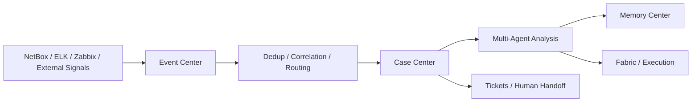

# AgenticOps

> 面向 NetBox / ELK / Zabbix 的 AgenticOps 智能运维工作台。  
> 聚焦统一事件、Case 编排、多智能体分析、执行闭环与运维记忆沉淀。

<p>
  <a href="./README_EN.md">English README</a>
</p>

<p>
  
  
  
  
  
</p>


## 目录

- [项目简介](#项目简介)
- [核心能力](#核心能力)
- [界面预览](#界面预览)
- [典型链路](#典型链路)
- [快速开始](#快速开始)
- [配置说明](#配置说明)
- [核心模块](#核心模块)
- [项目结构](#项目结构)
- [作者与联系](#作者与联系)
- [Star 趋势](#star-趋势)

## 项目简介

AgenticOps 是一个面向网络运维场景的智能运维工作台，用统一事件模型把 `NetBox`、`ELK`、`Zabbix` 等系统接入到同一条分析与处置链路中。

项目当前主链路已经收敛为：

`Event -> Case -> Multi-Agent -> Memory -> Fabric`

它不是单一的监控看板，而是一个强调“降噪、关联、编排、执行、沉淀”的 AgenticOps 平台，适合用于：

- 多数据源告警统一入口与事件治理
- 网络故障初判、证据汇聚与 Case 编排
- 多智能体协同分析与修复建议生成
- 执行记录审计、记忆沉淀与经验复用

## 核心能力

- 统一事件中心：接入日志信号、Zabbix 告警与外部事件，执行去重、聚类、关联和分流。
- Case 中心：把值得深度处理的问题提升为 Case，统一查看证据、智能体结论和修复计划。
- 多智能体协同：内置 `Alert Triage`、`Historical Analysis`、`Insight Analysis`、`Autonomous Remediation` 四类智能体。
- 记忆沉淀：把 episode、pattern、outcome、feedback 沉淀到记忆中心，为后续判断提供历史上下文。
- 执行闭环：在执行中心管理修复计划、执行记录和人工介入边界。
- 数据源工作台：提供资产拓扑、日志中心、Zabbix 中心、工单与设置页，形成完整运行面。

## 界面预览

当前仓库已包含一张总览图，建议直接用 README 顶部大图作为首屏展示，下面继续补充模块级截图即可。

### 推荐截图编排

如果你准备把更多截图加入 README，建议按下面的顺序组织，而不是把所有页面平铺出来：

| 分组 | 推荐页面 | 作用 |
| --- | --- | --- |
| 首屏总览 | 驾驶舱 | 让读者先理解平台全貌和核心指标 |
| 核心闭环 | 事件中心、Case 中心、执行中心 | 讲清楚从事件到处置的主链路 |
| 智能能力 | 智能体中心、记忆中心 | 展示多 Agent 和经验沉淀能力 |
| 数据源能力 | 日志中心、Zabbix 中心、资产拓扑 | 展示平台如何接入与利用底层数据源 |

### 推荐命名方式

建议把 README 专用截图统一放在 `docs/images/readme/`，命名保持固定顺序：

- `01-dashboard.png`
- `02-events.png`
- `03-cases.png`
- `04-fabric.png`
- `05-agents.png`
- `06-memories.png`
- `07-logs.png`
- `08-zabbix.png`
- `09-assets.png`

### 截图设计建议

- README 首屏保留 `1` 张总览大图，不要一开始连续堆很多截图。
- 第二屏建议只放 `4` 张核心图：`驾驶舱 / 事件中心 / Case 中心 / 资产拓扑`。
- 其余页面放到 “更多界面” 或 “模块说明” 小节，避免首屏过长。
- 截图发布前统一隐藏内网 IP、域名、主机名、Token、工单编号等敏感信息。
- 建议统一为 `16:9` 或接近 `16:9` 的裁切比例，保持 README 视觉整齐。

## 典型链路



统一事件中心的输出目前收敛为三类结果：

- `noise`
- `ticket_only`
- `case_required`

## 快速开始

### 1. 环境要求

- Python `3.11+`
- Node.js `18+`
- PostgreSQL `14+`
- 可访问的 `NetBox / ELK / Zabbix / LLM API`

### 2. 配置后端环境变量

复制示例配置：

```bash
cp deploy/env.example backend/.env
```

然后按你的实际环境补齐 `backend/.env` 中的数据库、数据源与模型配置。

### 3. 启动后端

```bash
cd backend
python3 -m venv venv
source venv/bin/activate
pip install -r requirements.txt
python3 main.py
```

默认启动后可访问：

- API: `http://localhost:8000`
- Docs: `http://localhost:8000/docs`
- Health: `http://localhost:8000/health`

### 4. 启动前端

```bash
cd frontend
npm install
npm run dev
```

默认启动后可访问：

- Web UI: `http://localhost:5173`

Vite 会把前端 `/api` 请求代理到 `http://localhost:8000`。

### 5. 快速验证

```bash
curl http://localhost:8000/health
```

如果数据库连接正常，接口会返回健康状态；数据库不可用时会返回 `503`。

## 配置说明

首版最关键的配置项如下：

| 变量名 | 说明 |
| --- | --- |
| `APP_SECRET_KEY` | 应用密钥，生产环境请使用长随机值 |
| `DATABASE_URL` | 主 PostgreSQL 连接串 |
| `AUTOMATION_DATABASE_URL` | 自动化数据库连接串，可与主库分离 |
| `NETBOX_URL` / `NETBOX_API_TOKEN` | 资产与拓扑数据源 |
| `ELK_URL` / `ELK_USERNAME` / `ELK_PASSWORD` | 日志数据源 |
| `ZABBIX_URL` / `ZABBIX_API_URL` / `ZABBIX_USERNAME` / `ZABBIX_PASSWORD` | 告警与状态数据源 |
| `LLM_API_URL` / `LLM_API_KEY` / `LLM_MODEL_NAME` | 模型服务配置 |
| `FRONTEND_URL` | 前端访问地址，用于 CORS |
| `AUTOMATION_OBSERVE_ONLY` | 安全开关，阻止非只读自动化动作 |

## 核心模块

| 模块 | 路由 | 作用 |
| --- | --- | --- |
| 驾驶舱 | `/` | 总览 Case、Agent、Memory 和分流指标 |
| 事件中心 | `/events` | 统一查看事件、聚类与根因候选 |
| Case 中心 | `/cases` | 查看证据、智能体输出与修复计划 |
| 执行中心 | `/fabric` | 管理修复计划、执行记录与 Automation Fabric |
| 智能体中心 | `/agents` | 查看智能体目录、健康度与运行情况 |
| 记忆中心 | `/memories` | 管理 episode / pattern / outcome |
| 日志中心 | `/logs` | 日志检索、范围筛选与聚合分析 |
| Zabbix 中心 | `/zabbix` | 查看活跃告警、主机异常与同步状态 |
| 资产拓扑 | `/assets` | 查看设备、IP、机柜、VLAN 与前缀 |
| 工单 | `/tickets` | 人工闭环与工单追踪 |
| 设置 | `/settings` | 集成配置、模型配置和 SSH 通道 |

## 项目结构

```text
netops_bs/
├── backend/
│   ├── api/                 # FastAPI 路由
│   ├── agents/              # 多智能体逻辑
│   ├── services/            # 领域服务
│   ├── models/              # 数据模型
│   ├── config/              # 配置与日志
│   ├── database.py          # 数据库初始化
│   └── main.py              # FastAPI 入口
├── frontend/
│   ├── src/
│   │   ├── api/             # 前端 API 封装
│   │   ├── components/      # 通用组件
│   │   ├── pages/           # 页面实现
│   │   └── router/          # 路由配置
│   └── package.json
├── deploy/
│   ├── env.example          # 示例环境变量
│   └── start.sh             # 后端启动脚本
├── docs/                    # 设计、迁移与部署文档
└── agenticops.jpg           # 当前 README 总览图
```

## 作者与联系

- 微信公众号：`数字卢语`
- 邮箱：`jayce_lu@foxmai.com`

欢迎围绕事件治理、AgenticOps、网络运维自动化与数据源接入提交 Issue 或 PR。

## Star 趋势

<picture>
  <source
    media="(prefers-color-scheme: dark)"
    srcset="https://api.star-history.com/svg?repos=Jaycelu/netops_bs&type=Date&theme=dark"
  />
  <source
    media="(prefers-color-scheme: light)"
    srcset="https://api.star-history.com/svg?repos=Jaycelu/netops_bs&type=Date"
  />
  
</picture>
