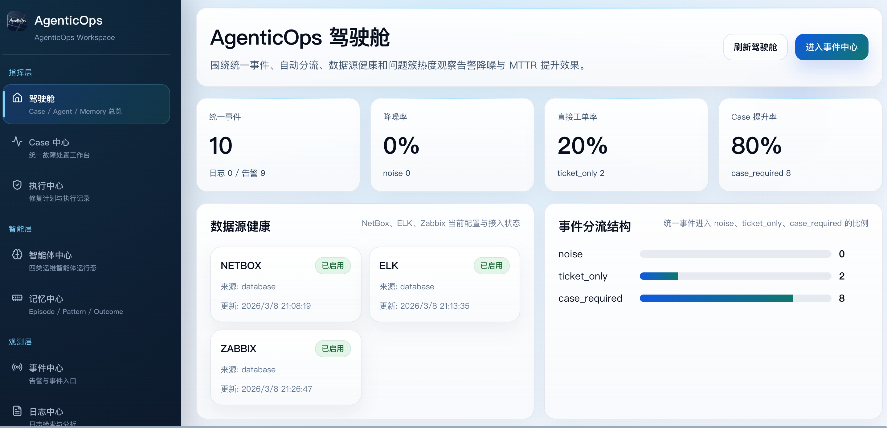
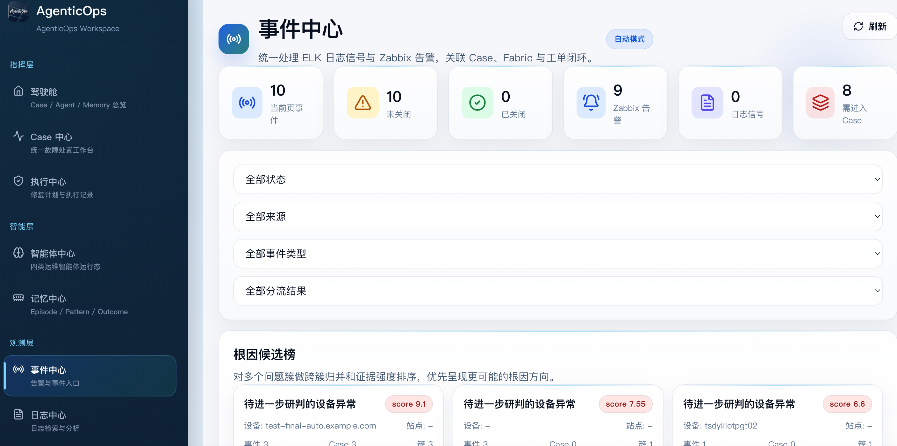
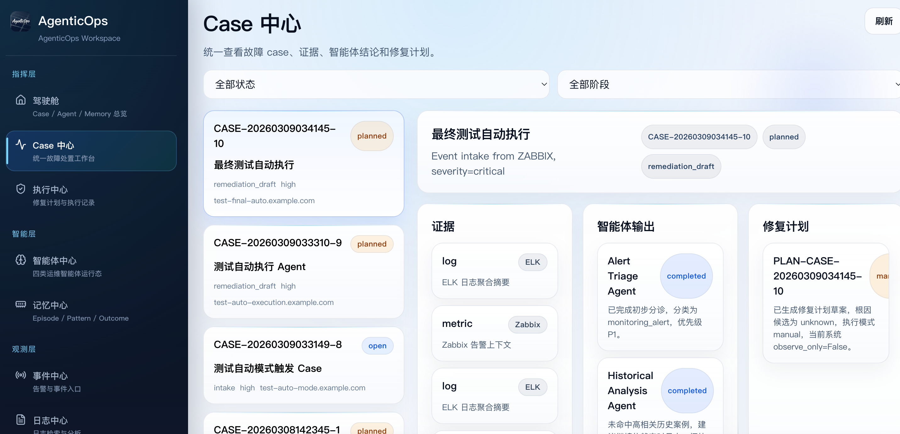
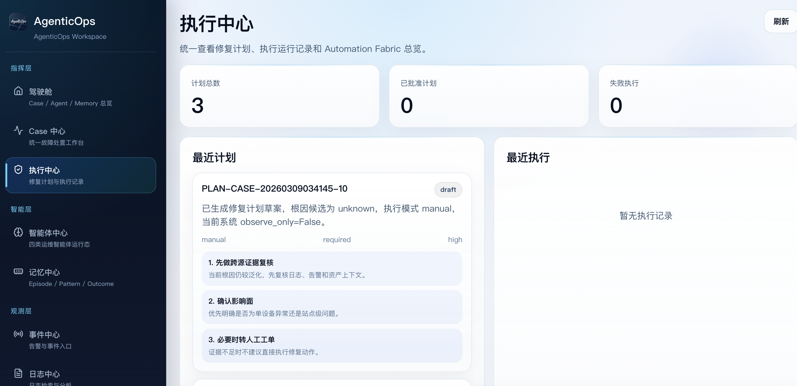
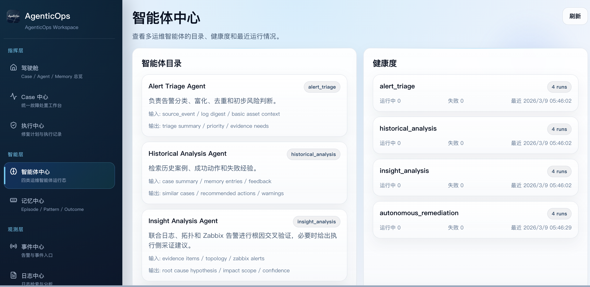
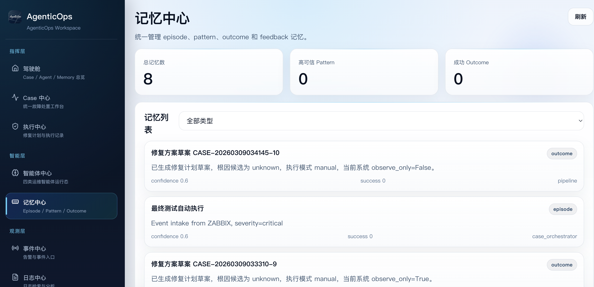
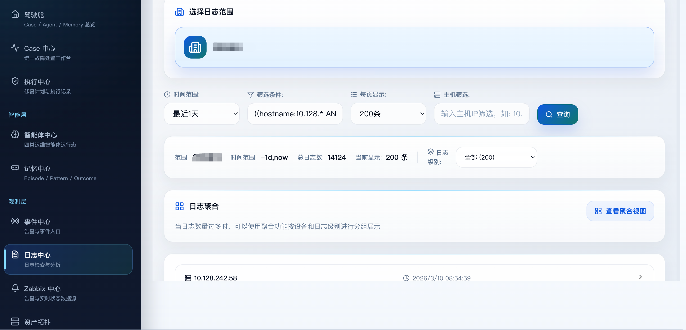
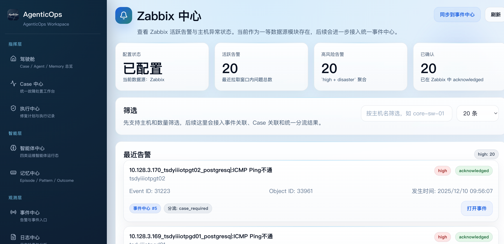
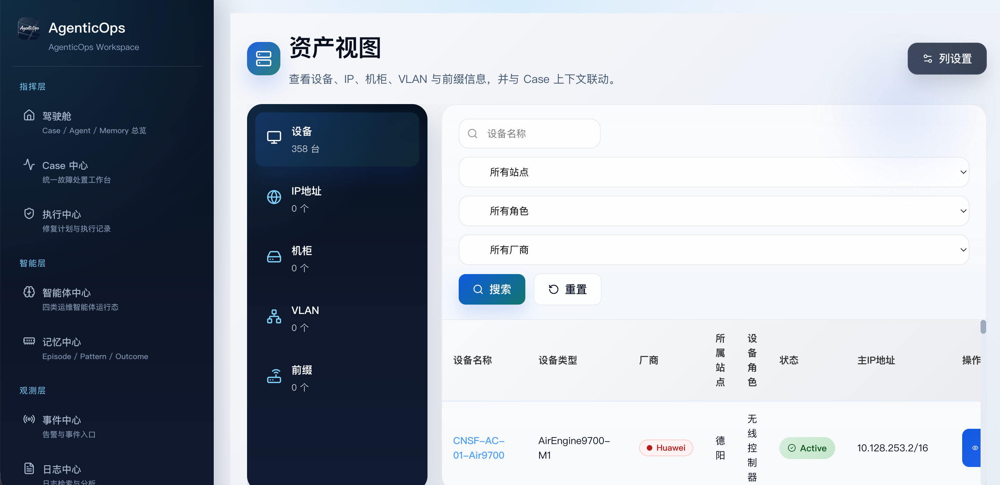
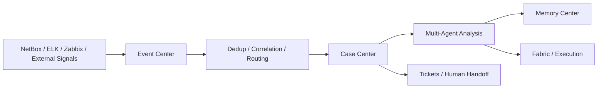

<div align="center">

# AgenticOps

NetBox / ELK / Zabbix AgenticOps 运维系统  
统一事件、Case 编排、多智能体分析、执行闭环、运维记忆

[English README](./README_EN.md)

<p>
  
  
  
  
  
  
</p>

</div>

<p align="center">
  
</p>

## 目录

- [项目简介](#项目简介)
- [核心能力](#核心能力)
- [界面预览](#界面预览)
- [典型链路](#典型链路)
- [快速开始](#快速开始)
- [配置说明](#配置说明)
- [核心模块](#核心模块)
- [项目结构](#项目结构)

## 项目简介

AgenticOps 是面向网络运维场景的事件治理与执行闭环系统。系统通过统一事件模型接入 `NetBox`、`ELK`、`Zabbix` 等数据源，并将事件处理链路收敛到：

`Event -> Case -> Multi-Agent -> Memory -> Fabric / Execution`

## 核心能力

- 统一事件中心：日志信号、Zabbix 告警、外部事件接入、去重、聚类、关联、分流。
- Case 中心：证据、智能体结论、修复计划统一归档。
- 多智能体分析：`Alert Triage`、`Historical Analysis`、`Insight Analysis`、`Autonomous Remediation`、`Safety Critic`。
- 记忆中心：episode、pattern、outcome、feedback 管理。
- 执行中心：修复计划、审批状态、执行记录、策略审计。
- 数据源模块：资产拓扑、日志中心、Zabbix 中心、工单、系统设置。

## 界面预览

### 1. 驾驶舱


### 2. 事件到处置闭环

| 事件中心 | Case 中心 |
| --- | --- |
|  |  |

| 执行中心 |
| --- |
|  |

### 3. 智能体与记忆体系

| 智能体中心 | 记忆中心 |
| --- | --- |
|  |  |

### 4. 数据源模块

| 日志中心 | Zabbix 中心 |
| --- | --- |
|  |  |

| 资产拓扑 |
| --- |
|  |

## 典型链路



统一事件中心的输出目前收敛为三类结果：

- `noise`
- `ticket_only`
- `case_required`

## 快速开始

### 默认方式：Docker Compose

Compose 编排包含 PostgreSQL、后端 API、前端 Web 三个服务。

```bash
docker compose up --build
```

默认访问地址：

- Web UI: `http://localhost:5173`
- API: `http://localhost:8000`
- Docs: `http://localhost:8000/docs`
- Health: `http://localhost:8000/health`

服务清单：

| 服务 | 容器 | 端口 |
| --- | --- | --- |
| PostgreSQL | `netops-postgres` | `5432` |
| Backend | `netops-backend` | `8000` |
| Frontend | `netops-frontend` | `5173` |

根目录 `.env` 可覆盖 Compose 变量。示例见 `deploy/docker.env.example`。生产环境必须替换：

- `APP_SECRET_KEY`
- `POSTGRES_PASSWORD`
- 外部系统连接参数：`NETBOX_*`、`ELK_*`、`ZABBIX_*`、`LLM_*`

停止服务：

```bash
docker compose down
```

如需同时删除本地 PostgreSQL 数据卷：

```bash
docker compose down -v
```

### 开发模式：本地启动

#### 1. 环境要求

- Python `3.11+`
- Node.js `18+`
- PostgreSQL `14+`
- 可访问的 `NetBox / ELK / Zabbix / LLM API`

#### 2. 配置后端环境变量

复制示例配置：

```bash
cp deploy/env.example backend/.env
```

补齐 `backend/.env` 中的数据库、数据源与模型配置。

#### 3. 启动后端

```bash
cd backend
python3 -m venv venv
source venv/bin/activate
pip install -r requirements.txt
python3 main.py
```

#### 4. 启动前端

```bash
cd frontend
npm install
npm run dev
```

Vite 会把前端 `/api` 请求代理到 `http://localhost:8000`。

#### 5. 验证

```bash
curl http://localhost:8000/health
```

数据库连接异常时接口返回 `503`。

## 配置说明

首版最关键的配置项如下：

| 变量名 | 说明 |
| --- | --- |
| `APP_SECRET_KEY` | 应用密钥，生产环境请使用长随机值 |
| `DATABASE_URL` | 主 PostgreSQL 连接串 |
| `AUTOMATION_DATABASE_URL` | 自动化数据库连接串，可与主库分离 |
| `NETBOX_URL` / `NETBOX_API_TOKEN` | 资产与拓扑数据源 |
| `ELK_URL` / `ELK_USERNAME` / `ELK_PASSWORD` | 日志数据源 |
| `ZABBIX_URL` / `ZABBIX_API_URL` / `ZABBIX_USERNAME` / `ZABBIX_PASSWORD` | 告警与状态数据源 |
| `LLM_API_URL` / `LLM_API_KEY` / `LLM_MODEL_NAME` | 模型服务配置 |
| `FRONTEND_URL` | CORS 前端地址 |
| `AUTOMATION_OBSERVE_ONLY` | 安全开关，阻止非只读自动化动作 |

## 核心模块

| 模块 | 路由 | 作用 |
| --- | --- | --- |
| 驾驶舱 | `/` | 总览 Case、Agent、Memory 和分流指标 |
| 事件中心 | `/events` | 事件、聚类、根因候选 |
| Case 中心 | `/cases` | 证据、智能体输出、修复计划 |
| 执行中心 | `/fabric` | 管理修复计划、执行记录与 Automation Fabric |
| 智能体中心 | `/agents` | 智能体目录、健康度与运行记录 |
| 记忆中心 | `/memories` | 管理 episode / pattern / outcome |
| 日志中心 | `/logs` | 日志检索、范围筛选与聚合分析 |
| Zabbix 中心 | `/zabbix` | 活跃告警、主机异常与同步状态 |
| 资产拓扑 | `/assets` | 设备、IP、机柜、VLAN 与前缀 |
| 工单 | `/tickets` | 人工闭环与工单追踪 |
| 设置 | `/settings` | 集成配置、模型配置和 SSH 通道 |

## 项目结构

```text
netops_bs/
├── backend/
│   ├── api/                 # FastAPI 路由
│   ├── agents/              # 多智能体逻辑
│   ├── services/            # 领域服务
│   ├── models/              # 数据模型
│   ├── config/              # 配置与日志
│   ├── database.py          # 数据库初始化
│   └── main.py              # FastAPI 入口
├── frontend/
│   ├── src/
│   │   ├── api/             # 前端 API 封装
│   │   ├── components/      # 通用组件
│   │   ├── pages/           # 页面实现
│   │   └── router/          # 路由配置
│   └── package.json
├── deploy/
│   ├── env.example          # 示例环境变量
│   └── start.sh             # 后端启动脚本
├── docs/
│   └── images/readme/       # README 系统截图
└── README.md
```
