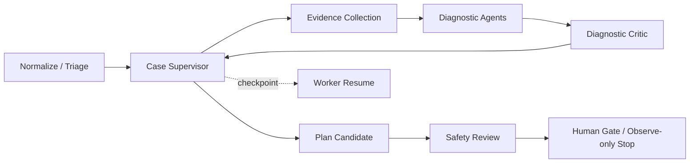
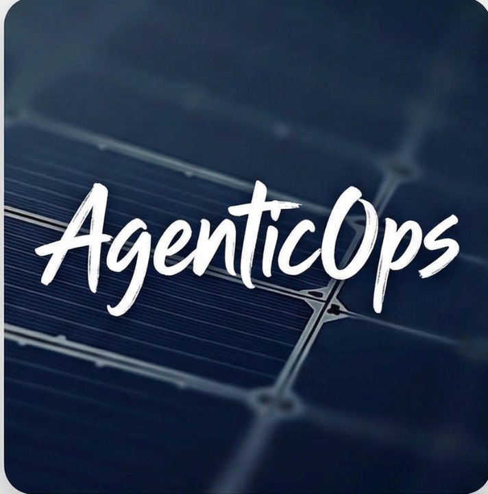

# AgenticOps

> Network operations system for NetBox, ELK, Zabbix, multi-agent analysis, execution workflows, and operational memory.

Current release: **v0.2.0**

[简体中文 README](./README.md)

## Overview

AgenticOps normalizes infrastructure signals into a single workflow:

`Event -> Case -> Multi-Agent -> Memory -> Fabric / Execution`

## Key Capabilities

- Unified event center for deduplication, clustering, correlation, and routing
- Case workspace for evidence, agent output, and remediation plans
- Built-in diagnostic and planning agents:
  - `Alert Triage Agent`
  - `Historical Analysis Agent`
  - `Insight Analysis Agent`
  - `Autonomous Remediation Agent`
  - `Safety Critic Agent`
  - `Diagnostic Critic Agent`
- Memory center for episode, pattern, and outcome reuse
- Execution center for remediation plans and run history
- Local/OIDC/LDAP/SAML authentication, RBAC, frozen approvals, and immutable audit records
- Guarded read-only device probes, generic signed webhooks, durable ELK ingestion, and post-change verification
- Source-oriented workspaces for assets, logs, Zabbix, tickets, and settings

Case diagnosis now runs as a durable asynchronous graph. The Supervisor creates conditional tasks from evidence and budget state; strict Evidence Requests pass through Tool Registry, PolicyGuard and Probe Gateway; an independent Diagnostic Critic searches for counter-evidence; and the Worker recovers expired leases from checkpoints. The graph still stops after Safety Review in Observe-only mode and never autonomously performs a device change. See [Multi-Agent Diagnostic Architecture](./docs/MULTI_AGENT_DIAGNOSTIC_ARCHITECTURE.md) and [Migration 0011](./docs/MIGRATION_0011_MULTI_AGENT_GRAPH.md).

### What changed in v0.2.0

- `POST /api/cases/{case_id}/run-agents` now returns `202 Accepted` after persisting a Graph Job; the Worker advances it asynchronously.
- Agent tasks, messages, tool calls, budgets, checkpoints, timelines, state transitions, and hypotheses are durable and auditable.
- The Supervisor can request additional evidence, run a bounded read-only Probe, persist the result, and trigger a new diagnostic round.
- The independent Diagnostic Critic can accept, revise, or reject a hypothesis using referenced Evidence IDs.
- The Case page polls durable Graph state and restores its Timeline, Hypothesis Board, and Budget Panel after refresh.
- OpenAI/httpx versions are pinned to a tested combination; tests without an API key do not initialize an external client.



## Screenshot



## Quick Start

### Docker Compose

Compose starts one PostgreSQL database, a one-shot migration job, backend API, background worker, and frontend Web.

```bash
cp deploy/docker.env.example .env
# Replace APP_SECRET_KEY, POSTGRES_PASSWORD, AUTH_PUBLIC_BASE_URL, and FRONTEND_URL.
docker compose config -q
docker compose build
docker compose up -d postgres
docker compose run --rm migrate
docker compose up -d backend worker frontend
```

Endpoints:

- Web UI: `http://localhost:5173`
- API: `http://localhost:8000`
- Docs: `http://localhost:8000/docs`
- Health: `http://localhost:8000/health/ready`

Services:

| Service | Container | Port |
| --- | --- | --- |
| PostgreSQL | `agenticops-postgres` | `5432` |
| Migration | `agenticops-migrate` | one-shot job |
| Backend | `agenticops-backend` | `8000` |
| Worker | `agenticops-worker` | no public port |
| Frontend | `agenticops-frontend` | `5173` |

Keep `AUTOMATION_OBSERVE_ONLY=True` during initial deployment and the 14-day shadow period. Production also requires an HTTPS reverse proxy; Compose does not issue TLS certificates. See [DEPLOYMENT.md](./DEPLOYMENT.md) for the complete installation and upgrade procedure.

For production, deploy a verified release tag. Before upgrading to v0.2.0, back up PostgreSQL and review [Migration 0011](./docs/MIGRATION_0011_MULTI_AGENT_GRAPH.md) and the [v0.2.0 release notes](./docs/RELEASE_NOTES_v0.2.0.md).

```bash
docker compose down
```

### Local Development

Requirements:

- Python `3.11+`
- Node.js `18+`
- PostgreSQL `14+`
- Reachable `NetBox / ELK / Zabbix / LLM API`

### Backend

```bash
cp deploy/env.example backend/.env
cd backend
python3 -m venv venv
source venv/bin/activate
pip install -r requirements.txt
alembic upgrade head
uvicorn main:app --host 0.0.0.0 --port 8000
# Start `python -m worker` in a second terminal.
```

Frontend:

```bash
cd frontend
npm install
npm run dev
```

## Asynchronous Graph API

Starting a run is non-blocking by default:

```http
POST /api/cases/{case_id}/run-agents
```

The response contains `graph_run_id`, `current_state`, `current_node`, `queued`, and `already_running`. Repeating the request while a run is active returns the same run. An authorized operator can use `force_restart=true`; the cancelled run and all historical artifacts remain available. `wait=true` is a bounded compatibility option, not the frontend default.

Use these persisted query endpoints for polling and recovery:

- `GET /api/cases/{case_id}/graph-runs`
- `GET /api/cases/{case_id}/graph-runs/{graph_run_id}`
- `GET /api/cases/{case_id}/timeline`
- `GET /api/cases/{case_id}/hypotheses`
- `GET /api/cases/{case_id}/agent-budget`

All browser requests require the existing session, RBAC, and CSRF controls. The graph does not bypass Tool Registry, PolicyGuard, approvals, or Observe-only mode.

## Safety Defaults

- Keep `AUTOMATION_OBSERVE_ONLY=True` for first deployment and shadow validation.
- Agent-selected tools must be both `agent_selectable=true` and `read_only=true`.
- Every tool call is policy-checked, persisted, and mapped to Evidence.
- Generic high-risk tools remain backward compatible but are not Agent-selectable.
- No real device change is performed by the v0.2.0 diagnostic graph.

Graph limits are controlled with `AGENT_GRAPH_LEASE_SECONDS`, the `AGENT_MAX_*` budget variables, and the `HYPOTHESIS_*` confirmation thresholds in the environment templates.

## Verification

The release gate includes backend unit/integration/scenario tests against PostgreSQL, Alembic checks and migration round trips, frontend production build, Docker Compose health checks, Ruff, Bandit, pip-audit, and Python compileall. External systems use deterministic Fake Adapters in automated tests; production NetBox, ELK, Zabbix, device, webhook, SSO, and LLM integrations still require site acceptance and the documented shadow period.

Operational procedures are in [DEPLOYMENT.md](./DEPLOYMENT.md), [Production Operations](./docs/PRODUCTION_DEPLOYMENT.md), [Runbook](./docs/RUNBOOK.md), and [Release Precheck](./docs/RELEASE_PRECHECK.md).

## Main Modules

| Module | Route | Purpose |
| --- | --- | --- |
| Dashboard | `/` | Platform overview across cases, agents, and memories |
| Events | `/events` | Unified event entry, clustering, and root-cause candidates |
| Cases | `/cases` | Evidence, agent conclusions, and remediation planning |
| Fabric | `/fabric` | Remediation plan execution and run history |
| Agents | `/agents` | Agent catalog and health status |
| Memories | `/memories` | Episode / pattern / outcome management |
| Logs | `/logs` | Log search and aggregation |
| Zabbix | `/zabbix` | Alert and host status view |
| Assets | `/assets` | Device, IP, rack, VLAN, and prefix context |
| Tickets | `/tickets` | Human handoff and tracking |
| Settings | `/settings` | Integrations, model setup, and SSH channels |

## Project Structure

```text
agenticops/
├── backend/
├── frontend/
├── deploy/
├── docs/
└── agenticops.jpg
```

## Runtime Stack

- Frontend: `Vue 3 + Vite + Nginx`
- Backend: `FastAPI + PostgreSQL`
- Compose: PostgreSQL, migration, backend API, worker, frontend
