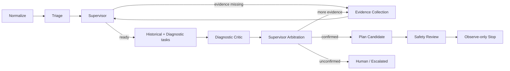

# Multi-Agent Diagnostic Core

## Scope and safety boundary

This release replaces the request-bound fixed agent sequence with a durable diagnostic graph. It does not expand autonomous production changes. `AUTOMATION_OBSERVE_ONLY=True` remains the default; agent-selected tools must be both `agent_selectable=true` and `read_only=true`. Every probe still passes through Tool Registry, PolicyGuard and Probe Gateway. Existing authentication, RBAC, approval, frozen plans, idempotent execution, Webhook Outbox, ELK noise reduction, post-change verification and Observe-only behavior remain in place.

## Audited legacy call chain

The chain below was derived from code, not README text:

```text
backend/api/cases.py
  -> backend/engines/case_orchestrator.py::run_legacy_case_pipeline
  -> backend/orchestration/pipeline_engine.py
  -> ContextCollector
  -> AlertTriageAgent
  -> HistoricalAnalysisAgent
  -> InsightAnalysisAgent (at most two insight rounds)
  -> AutonomousRemediationAgent
  -> SafetyCriticAgent
  -> StateFinalizer
```

`next_evidence_requests` existed only in AgentClaim metadata; no worker consumed it. `backend/worker.py` handled webhook, ingestion and verification work but had no Case graph recovery path. Case state was written from several services. The Probe Gateway and production execution safety gates were real and have been retained.

## Implementation audit

| Area | Before this release | Current implementation |
| --- | --- | --- |
| Agent runs and claims | Implemented and persisted | Retained; linked to graph run and task |
| AgentTask / Message / ToolCall | Not implemented | Persisted and used by Worker/Supervisor/API/UI |
| Evidence requests | Claim metadata only | Strict schema -> task -> PolicyGuard -> probe -> evidence response -> next diagnostic round |
| Dynamic orchestration | Fixed JSON pipeline | Supervisor creates conditional tasks in a durable graph |
| Critic | Safety plan critic only | Independent deterministic diagnostic critic plus safety critic |
| Budget | Not implemented | Persisted limits and usage for runs, LLM, tools, probes, replans, runtime and targets |
| Checkpoint/resume | Not implemented | Checkpoint after nodes; expired Worker leases recover running tasks |
| Case state | Multiple direct writers | Central transition service, transition record and Timeline event |
| Tool safety | Real registry/guard/gateway | Retained; autonomous selection restricted to read-only catalog entries |
| Frontend multi-agent view | Agent/Case pages showed runs and claims | Case page polls Graph Run, Timeline, hypotheses and budget |
| External systems in tests | Mocked in selected tests | New graph/scenario tests use controlled Fake Adapters |

## Durable graph



Ready historical and diagnostic tasks form a bounded parallel task set. A Case graph uses a database lease and idempotency keys; the current worker serializes commits within a Case to avoid concurrent evidence/state corruption, while multiple Cases can be processed independently.

## Confirmation rules

Thresholds live in `backend/config/settings.py`. A hypothesis is confirmable only when it reaches the configured confidence, cites fresh evidence, has no excessive high-weight contradictions, is not rejected by Critic, and has either one direct device command evidence item or two independent evidence sources.

## API behavior

`POST /api/cases/{case_id}/run-agents` returns `202 Accepted` after persisting a Graph Run. An existing active run is returned idempotently. `force_restart=true` requires `agent_graphs.restart`, cancels the old run without deleting its checkpoint, evidence, claims or timeline, then audits and creates a new run. `wait=true` is a bounded compatibility option; timeout never cancels the durable job.

Query endpoints:

- `GET /api/cases/{case_id}/graph-runs`
- `GET /api/cases/{case_id}/graph-runs/{graph_run_id}`
- `GET /api/cases/{case_id}/timeline`
- `GET /api/cases/{case_id}/hypotheses`
- `GET /api/cases/{case_id}/agent-budget`

## Deliberate limitations

- No high-risk autonomous tool is selectable by an Agent.
- Safety Review stops in Observe-only; the graph does not enter production execution in this release.
- Human resume currently requires an operator-provided credential followed by a controlled restart; a dedicated resume API and interactive human task form are next-stage work.
- Cross-Case task execution is concurrent through workers, but nodes inside one Case commit serially.

